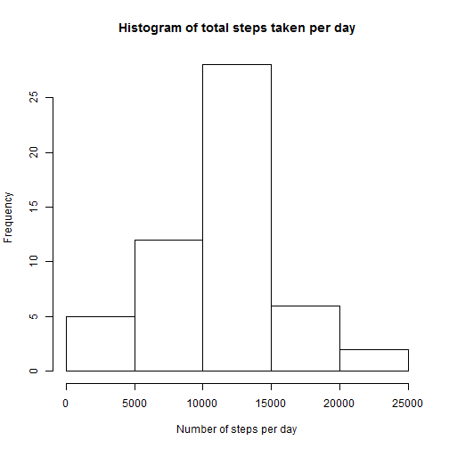
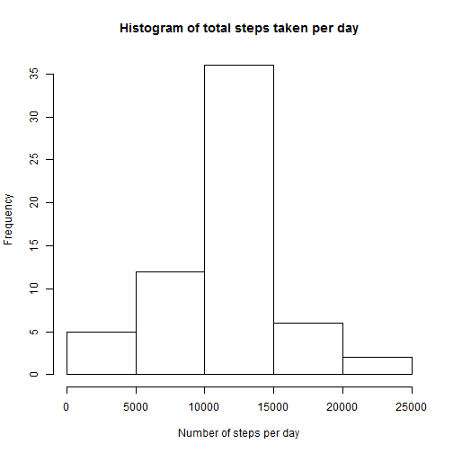

# Reproducible Research: Peer Assessment 1

## Loading and preprocessing the data

```r
library(ggplot2)
activity = read.csv("activity.csv")
total_steps <- aggregate(steps ~ date, data=activity, sum, na.rm=TRUE)
```

## What is mean total number of steps taken per day?

### Histogram

```r
hist(total_steps$steps, xlab="Number of steps per day", main="Histogram of total steps taken per day")
```

 

### The mean for total number of steps taken per day

```r
mean_step <- mean(total_steps$steps)
mean_step
```

```
## [1] 10766.19
```

### The median for total number of steps taken per day

```r
median_step <- median(total_steps$steps)
median_step
```

```
## [1] 10765
```

## What is the average daily activity pattern?

### Time series plot

```r
mean_steps_interval <- aggregate(steps ~ interval, data = activity, mean, na.rm = TRUE)
plot(steps ~ interval, data = mean_steps_interval, type = "l")
```

 

### The 5 minute interval that contains the maximum number of steps

```r
max_steps <- mean_steps_interval[which.max(mean_steps_interval$steps), ]$interval
max_steps
```

```
## [1] 835
```

## Imputing missing values

### The total number of missing values in the dataset

```r
missingCount <- sum(is.na(activity$steps))
missingCount
```

```
## [1] 2304
```

### Devise a strategy for filling in all of the missing values in the dataset. The strategy does not need to be sophisticated. For example, you could use the mean/median for that day, or the mean for that 5-minute interval, etc.


```r
fillStepsForInterval <- function(interval) {
    mean_steps_interval[mean_steps_interval$interval == interval, ]$steps
}
```
* The function above is how we are filling in the missing values, just using the mean of steps for the interval.

### Create a new dataset that is equal to the original dataset but with the missing data filled in.

```r
activityFilled <- activity  # This is to make a new dataset with the original data
count = 0  # Count the number of data filled in
for (i in 1:nrow(activityFilled)) {
    if (is.na(activityFilled[i, ]$steps)) {
        activityFilled[i, ]$steps <- fillStepsForInterval(activityFilled[i, ]$interval)
        count = count + 1
    }
}
```
* new dataset is created with the above code

### Make a histogram of the total number of steps taken each day and Calculate and report the mean and median total number of steps taken per day. Do these values differ from the estimates from the first part of the assignment? What is the impact of imputing missing data on the estimates of the total daily number of steps?

#### Histogram

```r
totalSteps2 <- aggregate(steps ~ date, data = activityFilled, sum)
hist(totalSteps2$steps, xlab="Number of steps per day", main="Histogram of total steps taken per day")
```

 

### mean for total number of steps taken per day

```r
meanFilled <- mean(totalSteps2$steps)
meanFilled
```

```
## [1] 10766.19
```
* mean for total number of steps taken per day ```{r}meanFilled```

### median for total number of steps taken per day

```r
medianFilled <- median(totalSteps2$steps)
medianFilled
```

```
## [1] 10766.19
```

### Do these values differ from the estimates from the first part of the assignment? What is the impact of imputing missing data on the estimates of the total daily number of steps?
* The mean value is the same as before. But Median value increased in the dataset that has imputed missing data.

## Are there differences in activity patterns between weekdays and weekends?

### Factor data into weekdays and weekend

```r
activityFilled$day = ifelse(as.POSIXlt(as.Date(activityFilled$date))$wday%%6 == 
    0, "weekend", "weekday")
# For Sunday and Saturday : weekend, Other days : weekday
activityFilled$day = factor(activityFilled$day, levels = c("weekday", "weekend"))
```

### Chart to Compare Weekdays and Weekend

```r
mean_steps_interval2 = aggregate(steps ~ interval + day, activityFilled, mean)
library(lattice)
xyplot(steps ~ interval | factor(day), data = mean_steps_interval2, aspect = 1/2, 
    type = "l")
```

 

* For weekend, there are more peaks of steps taken throughout the day. For weekday, the peak of steps taken appear to be somewhere in the morning, then there is less activity in the rest of the day.


